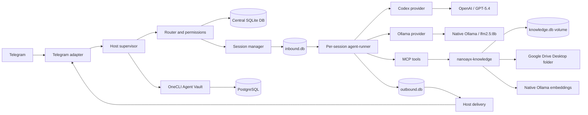

# NanoAYX

NanoAYX is an internal Alteryx AI work system based on the NanoClaw runtime.
It provides a Telegram-controlled coordinator, isolated specialist agents,
GPT-5.4 for complex work, Ollama for local lightweight text work, and a
Dockerized knowledge service backed by a designated Google Drive folder.

The system is designed for internal engineering, analysis, automation, and
knowledge work where an operator needs to delegate tasks to purpose-built
agents while keeping files, credentials, model access, and runtime state
separated by boundary.

## Current Status

The deployed profile is operational on macOS with:

- Telegram as the operator channel.
- Naya as the GPT-5.4 coordinator.
- Forge as the GPT-5.4 implementation and Alteryx specialist.
- Scribe as the local Ollama text worker.
- A Dockerized knowledge service connected to Google Drive Desktop.
- Ollama running natively for Metal acceleration and local inference.
- OneCLI and PostgreSQL providing credential and supporting infrastructure.
- Per-session agent containers running the Bun agent runner.

The active development branch is `codex-provider-stabilization` in the
[NanoAYX GitHub repository](https://github.com/christophermoore-ayx1/nanoayx).

## What It Is Used For

NanoAYX is intended for:

- Researching Alteryx, project, process, and engineering documentation.
- Searching the internal knowledge base and returning source citations.
- Drafting briefs, plans, decision records, and technical documentation.
- Delegating complex coding, repository, workflow, and Alteryx work to Forge.
- Delegating summarization, extraction, classification, and text cleanup to Scribe.
- Creating generated notes and reviewable outputs in the designated Drive area.
- Running multi-step work through Telegram without exposing the host filesystem
  or Docker socket to an agent.
- Extending the system with new agents, providers, channels, MCP tools, and
  scheduled workflows.

Typical operator requests are sent to Naya in Telegram. Naya decides whether
to answer directly, search the knowledge base, delegate to Forge or Scribe, or
combine several results into a final response.

## System at a Glance

```text
Telegram
   |
   v
NanoAYX host supervisor
   |-- inbound routing and permissions
   |-- session lifecycle and Docker orchestration
   |-- outbound delivery and Telegram adapter
   |-- OneCLI credential integration
   |
   +--> per-session Docker agent container
   |       Bun agent-runner
   |          |-- Codex / GPT-5.4 provider
   |          |-- Ollama provider
   |          |-- MCP tools
   |          +-- inbound.db -> outbound.db
   |
   +--> nanoayx-knowledge container
   |       FastAPI + SQLite vector index
   |       Google Drive Desktop mount
   |       host Ollama embeddings
   |
   +--> native Ollama
   +--> OneCLI and PostgreSQL containers
```

The host supervisor is trusted infrastructure. Agents are workers. The
knowledge service is a separate application boundary. No application
container receives the Docker socket.

## Agent Topology

Agent groups are independently configured and receive their provider, model,
reasoning effort, workspace, memory, permissions, and destinations at spawn.

| Agent | Provider | Model | Current responsibility |
| --- | --- | --- | --- |
| Naya | `codex` | `gpt-5.4`, high effort | Telegram coordinator, retrieval, delegation, synthesis, final responses |
| Forge | `codex` | `gpt-5.4`, high effort | Complex implementation, repository changes, Alteryx workflows, technical investigation |
| Scribe | `ollama` | `lfm2.5:8b` | Summarization, extraction, classification, rewriting, and other tool-free text work |

### Naya: Coordinator

Naya is the primary Telegram-facing agent. It understands the operator's
request, chooses an execution path, uses knowledge retrieval when a response
depends on internal material, and delegates work that benefits from a
specialist. Naya uses GPT-5.4 for reliable tool use, multi-step reasoning,
delegation, and grounded synthesis.

### Forge: Implementation Specialist

Forge is a peer agent created and addressed through NanoAYX's agent-to-agent
routing. It runs in its own session container with the same GPT-5.4 Codex
profile. Forge is the preferred destination for code changes, repository
analysis, Alteryx Designer work, testing, and technical execution.

### Scribe: Local Text Worker

Scribe runs through the Ollama provider and is intentionally stateless and
tool-free. Naya should send Scribe all required source text together with a
self-contained transformation request. Scribe is appropriate for low-risk,
local work where MCP tools, filesystem access, and complex reasoning are not
needed. It should not be expected to search Drive or modify repositories.

### Adding an Agent

An agent is an agent group plus a workspace and provider configuration:

1. Create the agent group and workspace.
2. Give it focused `CODEX.md` or local instructions.
3. Choose its provider, model, effort, and allowed mounts.
4. Add only the destinations and MCP tools it needs.
5. Test a direct request and an agent-to-agent round trip.
6. Document its contract and update the topology table above.

Provider configuration is materialized when a session container is spawned;
restart the group after changing provider settings.

## Component Architecture



### Host Supervisor

The Node.js host owns channel adapters, routing, permissions, the central
database, session lifecycle, Docker container creation, outbound delivery,
stale-session recovery, and scheduled wakeups.

| Area | Code |
| --- | --- |
| Entry point and service wiring | `src/index.ts` |
| Inbound routing | `src/router.ts` |
| Session resolution | `src/session-manager.ts` |
| Container lifecycle | `src/container-runner.ts`, `src/container-restart.ts` |
| Outbound delivery | `src/delivery.ts` |
| Stale detection and scheduled work | `src/host-sweep.ts` |
| Central schema and migrations | `src/db/` |
| Channel infrastructure | `src/channels/` |
| Host-side provider setup | `src/providers/` |

### Agent Container

Each active session runs in a separate Docker container. The container runs a
Bun-based agent runner and has access only to explicitly mounted workspace,
memory, skills, session databases, and provider-specific configuration.

The runner polls `inbound.db`, formats messages, calls the selected provider,
exposes built-in MCP tools, parses
`<message to="destination">...</message>` blocks, and writes outbound
messages to `outbound.db`. It does not use stdin protocols, host IPC files,
or the Docker socket.

### Provider Layer

The provider abstraction lives under
`container/agent-runner/src/providers/`. Providers expose a common query,
push, end, abort, continuation, and event interface. Current providers include
Codex and Ollama, with mock providers for tests. Host-side provider
contributions can add environment variables and provider-specific mounts
without changing the core container lifecycle.

### Knowledge Service

`services/knowledge` is a FastAPI service in its own container. It:

- Scans the configured Google Drive Desktop directory incrementally.
- Hashes source files and removes stale index records.
- Extracts Markdown, text, CSV, JSON, YAML, HTML, PDF, and DOCX.
- Chunks content and requests embeddings from native Ollama.
- Stores derived documents, chunks, vectors, and errors in a named volume.
- Provides search, ingest, statistics, and controlled generated-output writes.

The service is exposed to the host at `http://127.0.0.1:8787` and to agent
containers as `http://nanoayx-knowledge:8787` on the private
`nanoayx-runtime` network.

## End-to-End Process Flow

1. The operator sends a message to the NanoAYX Telegram bot.
2. The Telegram adapter validates and normalizes the inbound event.
3. The host resolves the user, messaging group, agent group, and session.
4. The host writes the event to that session's `inbound.db`.
5. The supervisor starts or wakes the session's Docker container.
6. The Bun agent-runner claims pending rows and builds the provider prompt.
7. Codex runs GPT-5.4 for complex reasoning, tools, files, and delegation, or
   Ollama runs a local tool-free text transformation.
8. MCP calls may search the knowledge service, ingest sources, inspect stats,
   or write an approved generated output.
9. Agent-to-agent messages are written as routed outbound rows and wake the
   destination agent's session.
10. Final response blocks become `outbound.db` rows.
11. The host delivery loop validates and delivers those rows through Telegram.
12. Delivery state and platform message identifiers are recorded for recovery.

### SQLite Message Boundary

Each session uses two SQLite files with a single-writer rule:

```text
Host supervisor  --writes--> inbound.db  --reads--> agent container
Agent container  --writes--> outbound.db --reads--> host supervisor
```

This avoids SQLite write contention across Docker Desktop file mounts. The
host owns inbound state; the container owns outbound state. See
[`docs/db.md`](docs/db.md) for the schema contract.

### Duplicate Protection

Providers can emit the same completed response more than once when a
follow-up arrives while a prior turn is finalizing. The agent runner keeps an
active-query idempotency set keyed by reply context, destination, and body.
Repeated results are suppressed before they become outbound rows, while
different destinations and separate user wakes remain independent.

This protects the observed duplicate-result failure mode. Persistent
exactly-once delivery across a process crash remains a future enhancement and
would require a durable outbound idempotency key and delivery contract.

## Knowledge Base and Google Drive

The canonical knowledge boundary is the designated Drive folder:

- [NanoAYX Knowledge Base](https://drive.google.com/drive/folders/1B5BMKeFQiSquksNZh9J8iAam3Cl40CS8)
- Folder ID: `1B5BMKeFQiSquksNZh9J8iAam3Cl40CS8`

Recommended structure:

```text
NanoAYX Knowledge Base/
  00 Inbox/
  10 Sources/
  20 Notes/
  30 Projects/
  40 Generated/
  90 Archive/
```

The scanner reads source folders. Agent-generated writes are restricted to
`40 Generated` and are atomic. Google Drive Desktop supplies authentication
and filesystem synchronization; the knowledge service does not contain Drive
credentials.

Native `.gdoc`, `.gsheet`, and `.gslides` pointer files do not contain
the underlying document body and are recorded as ingestion errors. An
authenticated Drive API exporter is required if native Google Workspace files
must be indexed directly.

See [`docs/knowledge-base.md`](docs/knowledge-base.md) for configuration,
supported formats, API endpoints, MCP tools, and storage boundaries.

## Deployment Model

### Native on the Mac

- Google Drive Desktop: authenticated filesystem source boundary.
- Ollama: Metal-accelerated local inference and embeddings.
- NanoAYX supervisor: trusted lifecycle, routing, and channel process.

### Dockerized

- Per-session agent workers.
- `nanoayx-knowledge` FastAPI service.
- Named `nanoayx-kb-data` knowledge index volume.
- OneCLI and PostgreSQL supporting services.

Telegram remains an installed adapter in the trusted supervisor. Moving it to
another container would add a credential and delivery hop without improving
the current security boundary.

### Startup and Recovery

From the canonical worktree:

```bash
cd /Users/christopher.moore/Projects/NanoAYX/nanoclaw
docker start onecli-postgres-1 onecli
docker compose --env-file .env.knowledge up -d knowledge
PATH=/opt/homebrew/opt/node@22/bin:$PATH pnpm run build
/bin/zsh -lc 'launchctl kickstart -k gui/$(id -u)/com.nanoclaw-v2-2f3dfabc'
```

The knowledge service should report healthy at:

```bash
curl http://127.0.0.1:8787/health
```

The full recovery checkpoint is [`docs/NANOAYX-RESUME.md`](docs/NANOAYX-RESUME.md).
Deployment details and runtime boundaries are in
[`docs/deployment.md`](docs/deployment.md).

## Configuration

Copy `config/knowledge.env.example` to an ignored local
`.env.knowledge` and set the local Google Drive Desktop path. Do not commit
`.env`, `.env.knowledge`, credentials, `data/`, session databases, logs,
or Drive contents.

Provider settings are stored per agent group and materialized on container
spawn. Example Ollama configuration:

```bash
ncl groups config update --id <agent-group-id> --provider ollama --model lfm2.5:8b
ncl groups restart --id <agent-group-id>
```

Codex sessions use the host's Codex authentication copied into a private
per-session directory. OpenAI credentials are not placed in the general
workspace or exposed to unrelated containers. OneCLI remains the credential
boundary for supported outbound services.

## Extending NanoAYX

### New Provider

Implement `AgentProvider` under
`container/agent-runner/src/providers/`, register it in the factory, and add
a host-side contribution under `src/providers/` if it needs mounts or
environment variables. Add provider tests, a container smoke test, and a
documented routing policy.

### New Channel

Implement the channel adapter contract under `src/channels/`, register it
with the channel registry, add setup and pairing behavior, then test inbound
routing, outbound delivery, permissions, and platform formatting. Keep
channel credentials in the host boundary.

### New MCP Tool or Service

Add the tool to the agent-runner MCP server or create a separate service. Give
the tool the narrowest possible filesystem and network access. A new service
needs a healthcheck, private network membership, an explicit volume boundary,
unit tests, and an operational recovery procedure.

### New Specialist Agent

Prefer a focused agent contract over a general-purpose clone of Naya. Define
the work it accepts, provider and model, files and tools, destinations, reply
format, and failure behavior. Test its agent-to-agent route independently
before using it in a larger workflow.

### Knowledge-Base Enhancements

The next meaningful knowledge enhancements are an authenticated Google Drive
API export path for native Google Docs, Sheets, and Slides, richer metadata
and permissions, and a review workflow for generated outputs before
promotion into source folders.

## Security Model

- Only the host supervisor may call the Docker API.
- Agent and knowledge containers have no Docker socket.
- Host mounts pass an external allowlist and remain narrowly scoped.
- The knowledge service receives only the designated Drive root and index volume.
- Generated knowledge writes are restricted to the generated-output boundary.
- Provider credentials are isolated per session or injected through OneCLI.
- Agent-to-agent routing is explicit through the destination registry.
- Telegram access is governed by pairing and authorization rules.
- Runtime databases, credentials, logs, and Drive contents remain outside Git.

This is an internal work system, not a substitute for Alteryx enterprise data
governance. Review Drive permissions, model/data handling policies, retention,
and agent mount scopes before connecting sensitive material.

## Validation

Run host checks with Node 22 available:

```bash
PATH=/opt/homebrew/opt/node@22/bin:$PATH pnpm run typecheck
PATH=/opt/homebrew/opt/node@22/bin:$PATH pnpm exec vitest run --maxWorkers=1
```

Run knowledge checks:

```bash
docker compose --env-file .env.knowledge config --quiet
docker compose --env-file .env.knowledge run --rm --no-deps knowledge python -m unittest discover -s tests -v
```

Build and test the agent image:

```bash
./container/build.sh
docker run --rm --entrypoint bun -v "$PWD/container/agent-runner/src:/app/src:ro" nanoclaw-agent-v2-7166243d:latest test /app/src/poll-loop.test.ts
```

Before a release, validate knowledge health and retrieval, a fresh MCP search,
direct Naya Telegram work, Naya-to-Forge routing, Naya-to-Scribe routing, a
generated-output write under `40 Generated`, and no duplicate Telegram output.

## Repository Map

```text
src/                         Trusted host supervisor
src/channels/                Telegram and channel adapter infrastructure
src/providers/               Host-side provider setup
src/db/                      Central database and migrations
container/agent-runner/      Isolated Bun agent runtime and MCP tools
groups/                      Per-agent workspaces and instructions
services/knowledge/          Dockerized Drive-backed knowledge service
config/                      Example local configuration
docs/                        Architecture, deployment, database, and recovery docs
scripts/                     Development and end-to-end validation scripts
```

Supporting documents:

- [`docs/architecture.md`](docs/architecture.md)
- [`docs/architecture-diagram.md`](docs/architecture-diagram.md)
- [`docs/agent-runner-details.md`](docs/agent-runner-details.md)
- [`docs/db.md`](docs/db.md)
- [`docs/isolation-model.md`](docs/isolation-model.md)
- [`docs/knowledge-base.md`](docs/knowledge-base.md)
- [`docs/deployment.md`](docs/deployment.md)
- [`docs/NANOAYX-RESUME.md`](docs/NANOAYX-RESUME.md)

## Git and Change Management

The canonical branch for this implementation is
`codex-provider-stabilization`. Test local changes, document operational or
architectural changes, commit with a focused message, and push to the NanoAYX
repository. Never commit credentials, runtime state, Docker volumes, or Drive
content.

## License

MIT
